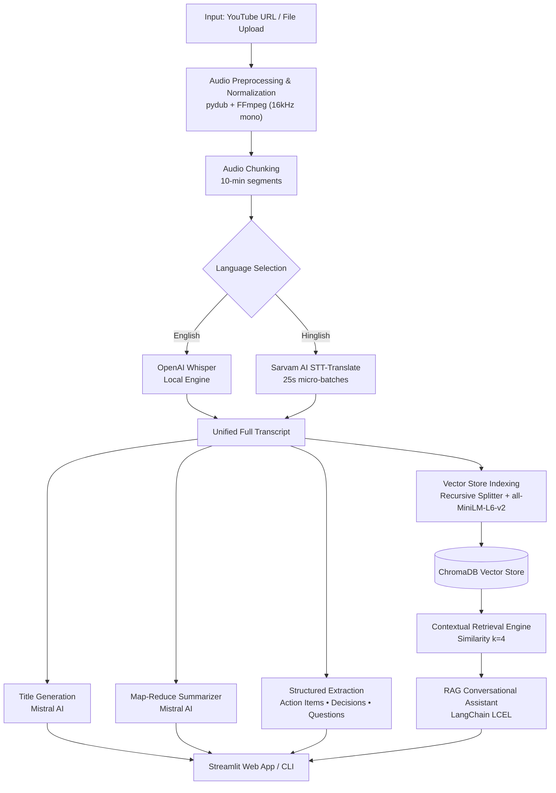

# 🎬 AI Video Assistant with RAG

[](https://www.python.org/)
[](https://python.langchain.com/)
[](https://mistral.ai/)
[](https://www.trychroma.com/)
[](https://github.com/openai/whisper)
[](https://streamlit.io/)

An end-to-end video and meeting intelligence platform built with **LangChain (LCEL)**, **Mistral AI**, **OpenAI Whisper**, **Sarvam AI**, and **ChromaDB**. 

The assistant ingests long-form video or audio from **YouTube URLs** or **local file uploads**, transcribes bilingual content (English & Hinglish), synthesizes structured executive summaries and action items, and powers an interactive, hallucination-resistant **Retrieval-Augmented Generation (RAG)** chat interface.

---

## ⚡ Key Features

- **Multi-Source Audio Ingestion**: Process YouTube links or uploaded local files (`.mp4`, `.mp3`, `.wav`, `.m4a`, `.mov`, `.mkv`, `.webm`) using `yt-dlp` and `pydub`.
- **Intelligent Audio Chunking**: Automatically segments long recordings into 10-minute WAV windows (16kHz mono) to handle arbitrarily long meetings without memory bottlenecks.
- **Bilingual STT Routing**:
  - **English**: Local, privacy-conscious transcription with **OpenAI Whisper**.
  - **Hinglish**: Real-time Hindi-to-English translation and transcription via **Sarvam AI** (`saaras:v2.5`), chunked into 25-second API-compliant pieces.
- **Executive Insight Extraction**:
  - **Session Title**: Auto-generated concise title (≤ 8 words).
  - **Map-Reduce Summaries**: Recursive text-splitting with Mistral AI to summarize lengthy transcripts with built-in rate-limit throttling.
  - **Structured Action Items**: Extracts task description, assignee, and deadline.
  - **Key Decisions & Open Questions**: Synthesizes conclusions and unresolved topics.
- **Contextual RAG Chat**:
  - Dense semantic retrieval via `sentence-transformers/all-MiniLM-L6-v2`.
  - Chroma vector store with isolated session indexing.
  - Strict context-grounded prompting preventing hallucinations.
- **Modern Cyber-Dark UI**: Streamlit interface with live multi-stage pipeline status badges, responsive card layouts, and an interactive chat drawer.

---

## 🏗️ Architecture & Pipeline Flow



---

## 🗂️ Project Structure

```
ai_video_assistant_with_rag/
│
├── core/
│   ├── extractor.py         # LCEL chains for action items, key decisions, and questions
│   ├── rag_engine.py        # LCEL retrieval chain and conversational RAG logic
│   ├── summarizer.py        # Map-Reduce transcript summarizer & title generator
│   ├── transcriber.py       # Sarvam AI STT & optional Whisper routing and batching
│   └── vector_store.py      # Chroma vector database & HuggingFace embeddings
│
├── utils/
│   └── audio_processor.py   # YouTube downloading, FFmpeg format conversion & chunking
│
├── app.py                   # Streamlit web application with custom dark theme
├── main.py                  # Command-line interface (CLI) pipeline runner
├── test.py                  # Integration test script for core pipeline
│
├── packages.txt             # System APT dependencies for Streamlit Cloud (ffmpeg)
├── requirements.txt         # Project Python dependencies
├── .env.example             # Environment variable template
└── .gitignore               # Ignored files (artifacts, cache, env, vector_db)
```

---

## 🛠️ Tech Stack

| Component | Technology | Role |
|---|---|---|
| **Orchestration** | [LangChain (LCEL)](https://python.langchain.com/) | Composable prompt & retrieval pipelines |
| **Language Model** | [Mistral AI](https://mistral.ai/) (`open-mistral-nemo`) | Summarization, extraction, and RAG Q&A |
| **Speech-to-Text & Translation** | [Sarvam AI](https://www.sarvam.ai/) (`sarvamai` SDK) | Cloud STT for English & Hinglish translation |
| **Local STT (Optional)** | [OpenAI Whisper](https://github.com/openai/whisper) | Offline local English transcription |
| **Vector Store** | [ChromaDB](https://www.trychroma.com/) | Local persistent/session vector store |
| **Embeddings** | [HuggingFace](https://huggingface.co/) (`all-MiniLM-L6-v2`) | Dense semantic embeddings (384-dim) |
| **Audio Processing** | [pydub](https://github.com/jiaaro/pydub) + [yt-dlp](https://github.com/yt-dlp/yt-dlp) + FFmpeg | Audio extraction, conversion, and slicing |
| **Frontend** | [Streamlit](https://streamlit.io/) | Interactive dashboard and conversational UI |

---

## 🚀 Quickstart Guide

### 1. Prerequisites

- **Python 3.10–3.12**
- **FFmpeg**: Required for audio decoding and conversion.
  - *Windows*: Download from [gyan.dev](https://www.gyan.dev/ffmpeg/builds/) or install via `winget install Gyan.FFmpeg` / `choco install ffmpeg`. (The project also auto-detects `imageio-ffmpeg` if installed).
  - *macOS*: `brew install ffmpeg`
  - *Linux*: `sudo apt install ffmpeg`

### 2. Clone & Set Up Environment

```bash
# Clone the repository
git clone https://github.com/iamsouvik007/video-rag-assistant.git
cd video-rag-assistant

# Create and activate virtual environment
python -m venv .venv

# Windows
.venv\Scripts\activate

# macOS / Linux
source .venv/bin/activate

# Install dependencies
pip install -r requirements.txt
```

### 3. Configure API Keys

Copy the sample environment file and provide your API keys:

```bash
cp .env.example .env
```

Edit `.env`:

```env
# Mistral AI (Required for summaries, extraction, and RAG)
MISTRAL_API_KEY="your_mistral_api_key"
MISTRAL_MODEL="open-mistral-nemo"

# Sarvam AI (Required for Hinglish and Cloud English STT)
SARVAM_API_KEY="your_sarvam_api_key"
SARVAM_STT_MODEL="saaras:v2.5"

# Whisper (Optional local English STT model)
WHISPER_MODEL="base"
USE_LOCAL_WHISPER="false"
```

> **API Key Resources:**
> - Get a Mistral API key at [console.mistral.ai](https://console.mistral.ai/)
> - Get a Sarvam AI API key at [sarvam.ai](https://www.sarvam.ai/)

---

## 💻 Running the Application

### Option A: Streamlit Web Interface (Recommended)

Launch the interactive dark-mode dashboard:

```bash
streamlit run app.py
```

1. Enter a **YouTube URL**, **local path**, or **upload an audio/video file**.
2. Select your audio language (`english` or `hinglish`).
3. Click **⚡ Analyse** to trigger the pipeline.
4. Review generated meeting titles, summaries, action items, and full transcript.
5. Ask context-grounded questions in the **Chat with your Meeting** panel.

### Option B: Command-Line Interface (CLI)

Run the end-to-end pipeline directly in your terminal:

```bash
python main.py
```

You will be prompted for:
- Source (YouTube URL or local media path)
- Language (`english` or `hinglish`)

Once analysis finishes, an interactive Q&A session will start in the terminal.

---

## ☁️ Deploying on Streamlit Community Cloud

This project is fully configured for one-click deployment on [Streamlit Community Cloud](https://streamlit.io/cloud):

1. **Push your code to GitHub** (public or private repository).
2. Go to **share.streamlit.io** and click **Create app**.
3. Choose your repository: `iamsouvik007/video-rag-assistant`.
4. Configure the deployment settings:
   - **Branch**: `main`
   - **Main file path**: `app.py`
   - **Python version**: `3.11` (or `3.10` / `3.12`)
5. In **Advanced settings** -> **Secrets**, paste your API credentials:

```toml
MISTRAL_API_KEY = "your_actual_mistral_api_key"
MISTRAL_MODEL = "open-mistral-nemo"
SARVAM_API_KEY = "your_actual_sarvam_api_key"
SARVAM_STT_MODEL = "saaras:v2.5"
```

6. Click **Deploy!**
   - Streamlit Cloud automatically reads `packages.txt` to install system `ffmpeg`.
   - Streamlit Cloud installs dependencies from `requirements.txt`.
   - Audio transcription and translation run reliably via Sarvam AI without exceeding memory limits.

---

## ⚙️ How It Works

1. **Audio Extraction**: `utils/audio_processor.py` fetches the audio stream (via `yt-dlp` for YouTube) or extracts it from a local file, standardizes it to mono 16kHz WAV format, and slices it into 10-minute chunks.
2. **Speech Recognition**:
   - `hinglish` route: Audio chunks are partitioned into 25-second segments and submitted to Sarvam AI's STT-translate endpoint, outputting an English transcript.
   - `english` route: Transcribed using Sarvam AI STT in cloud deployment (or local `whisper` if enabled locally).
3. **Synthesis & Extraction**:
   - Long transcripts exceeding single-prompt thresholds are segmented using `RecursiveCharacterTextSplitter` and processed with a map-reduce pattern to preserve context.
   - Structured prompts extract numbered action items (with owner and deadline), key decisions, and open questions.
4. **Vector Store & RAG Engine**:
   - Transcripts are chunked (500 characters, 50 overlap) into Chroma vector records using HuggingFace's `all-MiniLM-L6-v2`.
   - Incoming user questions retrieve top-$k$ relevant passages ($k=4$).
   - Mistral AI answers strictly using retrieved context, eliminating cross-session bleed and hallucinations.


